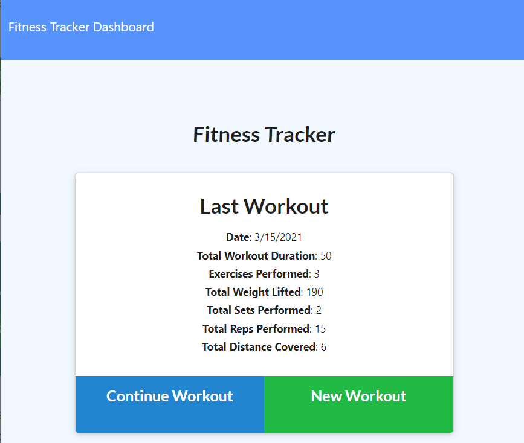

# WorkoutTracker17

### Description: 

The fitness app allows users to create view and track daily workouts.

### Installation:  

Download or clone repository. Do a Npm install to install the required npm packages to run

### Usage: 

Application will be invoked by using the following command: node server.js Open your browser and go to http://localhost:8080

 ### Contributing: 
 
  Contributions made by Jordan Mossing using various technolgies.

 ### Screenshot: 

 # 

 ## Questions:
 
Reach out to me on my GitHub page at the following Link:
 -[GitHub Profile](https://github.com/jmo1point0)    
 Or by email: jordan.mossing@gmail.com
 

 

